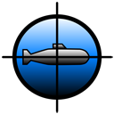

<p align="center">
  
</p>

# SeaRobots

[](https://github.com/thegreystone/searobots/actions/workflows/build.yml)
[](https://github.com/thegreystone/searobots/releases/latest)
[](https://jdk.java.net/25/)
[](LICENSE)

SeaRobots is a competitive autonomous underwater combat simulator inspired by
the classic [C-Robots](https://en.wikipedia.org/wiki/Crobots) (1985). The idea
was simple: what if you did Crobots, but in a vastly more complex environment?
It could be submarines, because then it would be SeaRobots (lol). 

Based on an idea and implementation from 2004, it will eventually be revised so
that submarines can participate in a language-agnostic manner and untrusted code
will be isolated using modern sandboxing techniques rather than the JVM Security
Manager (which was used by the original simulator).

Participants submit programs that control autonomous submarines and their
torpedoes in a real-time simulation. Matches are fully replayable in a 3D viewer.

Right now two subs are being built by Claude and Codex (with some human guidance, 
help and patience). They are also the two submarines that will battle by default.

---

## Vision

- Provide a safe arena for untrusted autonomous code to compete.
- Enforce strict real-time decision budgets: spend time thinking and you
  lose the chance to act.
- Enable deterministic simulation and full match replay. (Note: submarine
  implementations may use their own RNGs, so match outcomes are not
  guaranteed to be identical across runs.)
- Support rich 3D visualization of live and recorded matches.
- Encourage strategic tradeoffs between planning depth and responsiveness.

Each participant controls **one submarine** and **zero or more active
torpedoes**. All controlled entities share the same CPU budget per tick.

---

## Building

Requires Java 25+ and Maven 3.9+.

```bash
mvn clean install
```

### Running the Viewer

**Easiest:** download `searobots-<version>.jar` from the
[latest release](https://github.com/thegreystone/searobots/releases/latest) and run:

```bash
java -jar searobots-viewer-<version>.jar
```

**From source:**

```bash
mvn clean install -DskipTests
mvn exec:java -pl searobots-viewer -Dexec.mainClass=se.hirt.searobots.viewer.SubmarineScene3D
```

#### Viewer Controls

**Simulation:**

| Key | Action |
|-----|--------|
| Space | New random map |
| P | Pause / resume |
| N | Step one tick (when paused) |
| 1-5 | Speed: 1x, 2x, 4x, 8x, 16x |
| 0 | Maximum speed |
| F2 | Configure simulation (ship picker, seed) |
| F3 | Render settings (water, fog, lighting) |
| F11 | Maximize window |
| Esc | Menu (quit, restart) |

**Camera:**

| Key | Action |
|-----|--------|
| V | Cycle camera mode (Orbit, Chase, Target, Periscope, Free Look, Fly-by, Director) |
| Tab | Cycle between entities (subs + torpedoes). In Director mode, exits to Orbit. |
| Mouse drag | Orbit / pan (in Orbit and Free Look modes) |
| Scroll | Zoom (in Orbit and Free Look modes) |

**Overlays:**

| Key | Action |
|-----|--------|
| M | Toggle 2D map overlay |
| T | Toggle trails |
| R | Toggle route visualization |
| E | Toggle contact estimates |
| W | Toggle waypoints |
| G | Toggle strategic waypoints |
| B | Toggle collision volumes |
| I | Toggle score details |
| D | Pause on sub death |
| F | Pause on firing solution |
| L | Pause on torpedo launch |

**Clipboard:**

| Key | Action |
|-----|--------|
| Ctrl+C | Copy current seed to clipboard |
| Ctrl+V | Paste seed (in F2 dialog) |

#### Camera Modes

- **Orbit**: free orbit around the selected entity
- **Chase**: trailing camera behind the sub along its heading
- **Target**: chase camera looking toward the tracked contact
- **Periscope**: first-person from the conning tower
- **Free Look**: detached orbit with manual control
- **Fly-by**: static camera watching the entity pass by
- **Director** (default): automatic cinematic camera with event-driven
  cuts. Cycles through all entities with structured transitions
  (close underwater, birds-eye, tactical overview). Automatically
  cuts to torpedo launches, terminal approaches, and explosions.
  North-up overhead views for situational awareness.

#### Ship Configuration

Press **F2** to open simulation configuration. Select controllers
for each ship slot and optionally enter a hex seed for reproducible
matches:

- **Claude Sub**: Claude-authored attack submarine (custom torpedo AI)
- **Codex Sub**: Codex-authored attack submarine
- **Default Sub**: reference implementation (fires torpedoes)
- **Sub Drone**: simple patrol submarine (no combat AI)
- **Ship Drone**: noisy surface vessel (target practice)

Settings persist across seed changes and simulation restarts.

### Running Engine Tests

```bash
mvn test -pl searobots-engine
```

### Running the Competition

The competition framework runs all registered controllers through navigation
and head-to-head combat on the same set of deterministic seeds.

```bash
mvn exec:java -pl searobots-engine \
  -Dexec.mainClass=se.hirt.searobots.engine.SubmarineCompetition
```

With no arguments, a random master seed is generated. To reproduce
a specific competition, pass the master seed as a hex string:

```bash
mvn exec:java -pl searobots-engine \
  -Dexec.mainClass=se.hirt.searobots.engine.SubmarineCompetition \
  -Dexec.args="deadbeef"
```

The master seed deterministically generates all individual match seeds,
so the same master seed always produces the same competition.

To run combat only (skip navigation, faster iteration):

```bash
mvn exec:java -pl searobots-engine \
  -Dexec.mainClass=se.hirt.searobots.engine.SubmarineCompetition \
  -Dexec.args="deadbeef --combat-only"
```

A standard competition has two phases:

**Navigation phase** (5 seeds, 40 minutes each): each controller runs
solo through mandatory waypoints. Scoring is head-to-head per seed:

- Objectives reached (1pt first WP, +3pt second WP)
- Stealth metrics: depth, noise (lower wins)
- Efficiency: speed, path efficiency

**Combat phase** (same 5 seeds, 30 minutes each): every pair of
controllers fights on each seed. Each sub has 8 torpedoes.
Scoring per match:

- **Kill the enemy**: 5 points
- **Survive the match**: 5 points
- Both survive (timeout): 5 points each
- Both die: 0 points each

The final standings combine navigation and combat points.

#### Adding a new competitor

Edit `SubmarineCompetition.main()` and add your controller to the
competitors list:

```java
var competitors = List.of(
        new Competitor("MySubmarine", MySubmarine::new),
        new Competitor("ClaudeAttackSub", ClaudeAttackSub::new),
        new Competitor("CodexAttackSub", CodexAttackSub::new)
);
```

### Running a Quick Combat Test

To test your controller in combat without running a full competition,
write a JUnit test using `SimulationLoop` directly:

```java
@Test
void mySubVsDefault() {
    long seed = 0x1e001; // use a known seed, or try several
    var config = MatchConfig.withDefaults(seed);
    var world = new WorldGenerator().generate(config);

    var sim = new SimulationLoop();
    sim.setSpeedMultiplier(1_000_000); // run as fast as possible

    var controllers = List.<SubmarineController>of(
            new MySubmarine(), new DefaultAttackSub());
    var configs = List.of(VehicleConfig.submarine(), VehicleConfig.submarine());

    var listener = new SimulationListener() {
        @Override
        public void onTick(long tick, List<SubmarineSnapshot> subs,
                           List<TorpedoSnapshot> torps) {
            if (subs.size() >= 2) {
                // Log torpedo launches, HP changes, etc.
                if (tick % 5000 == 0) {
                    System.out.printf("tick=%d  %s hp=%d  %s hp=%d  torps=%d%n",
                            tick, subs.get(0).name(), subs.get(0).hp(),
                            subs.get(1).name(), subs.get(1).hp(), torps.size());
                }
            }
            if (tick >= 30_000) sim.stop(); // 10 minutes
        }
        @Override public void onMatchEnd() {}
    };

    var thread = new Thread(() -> sim.run(world, controllers, configs, listener));
    thread.start();
    try { thread.join(60_000); } catch (InterruptedException e) {}
    sim.stop();
}
```

Key points for headless testing:

- `setSpeedMultiplier(1_000_000)` removes the real-time throttle
- `MatchConfig.withDefaults(seed)` gives each sub 8 torpedoes, 1000 HP,
  50m blast radius
- Matches are fully deterministic for a given seed (assuming controllers
  don't use their own RNGs)
- Use the 3D viewer with the same seed to visually debug torpedo
  behaviour: press **F2**, paste the seed, and select your controller

### Watching a Specific Seed in the Viewer

To visually inspect a combat match:

1. Launch the viewer (starts in Director mode with cinematic camera)
2. Press **F2** to open simulation configuration
3. Select the two controllers to pit against each other
4. Paste a hex seed into the seed field
5. Press **Apply** to start
6. Watch the Director auto-switch between entities, overhead views, and torpedo events
7. Press **Tab** to exit Director mode and manually cycle between entities
8. Press **V** to switch camera modes, **B** to show collision volumes

---

## Project Structure

```
searobots/
├── searobots-api/           # Public Java API (SubmarineController, TorpedoController, records)
├── searobots-engine/        # Simulation engine (physics, world, sonar, torpedoes)
│   └── ships/               # Controller implementations
│       ├── DefaultAttackSub        # Reference submarine (fires torpedoes)
│       ├── SimpleTorpedoController # Default torpedo AI (active sonar + intercept)
│       ├── SubmarineDrone          # Simple patrol drone (no combat)
│       ├── TargetDrone             # Noisy surface ship (target practice)
│       ├── claude/
│       │   ├── ClaudeAttackSub        # Claude-authored submarine
│       │   └── ClaudeTorpedoController # Claude-authored torpedo AI
│       └── codex/
│           ├── CodexAttackSub         # Codex-authored submarine
│           └── CodexTorpedoController # Codex-authored torpedo AI
├── searobots-viewer/        # 3D viewer (jMonkeyEngine + Lemur GUI)
└── docs/                    # Design docs, implementation plan
```

### Writing a New Controller

1. Create a class implementing `SubmarineController` in a new subpackage
   under `se.hirt.searobots.engine.ships`.
2. Implement `name()`, `onMatchStart()`, and `onTick()`.
3. Optionally override `createTorpedoController()` to provide a custom
   `TorpedoController` for your torpedoes. If you don't override it,
   the default `SimpleTorpedoController` is used (active-sonar chase
   with intercept steering). Torpedoes exit fixed forward tubes, so
   off-axis attacks depend on submarine geometry and post-launch
   torpedo guidance rather than rotating the launch tube.
4. Add test classes extending `SurvivalTest` and `WorldNavigationTest`
   (provide your controller via `createController()`).
5. Add your controller to `SimConfigState.SHIP_OPTIONS` to make it
   available in the viewer.
6. Add it to `SubmarineCompetition.main()` to benchmark against others.
7. Write headless combat tests (see "Running a Quick Combat Test" above)
   to iterate on torpedo firing logic and evasion tactics.

See the [implementation plan](docs/implementation-plan.md) for current
progress and next steps.

---

## Documentation

- **[Design Document](docs/DESIGN.md):** architecture, execution model,
  control interfaces, physics, sonar, damage model, and design principles.
- **[Physics Research](docs/physics-research.md):** research notes on
  submarine physics from games, simulations, and academic papers.
- **[Passive Sonar / TMA Design](docs/passive-sonar-tma-design.md):**
  engine-side Target Motion Analysis that provides controllers with
  progressively accurate contact data.
